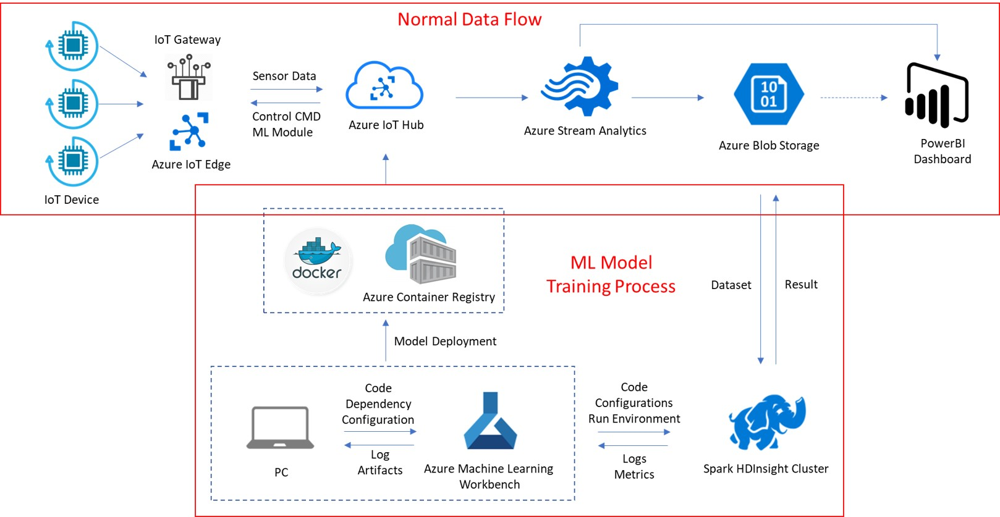
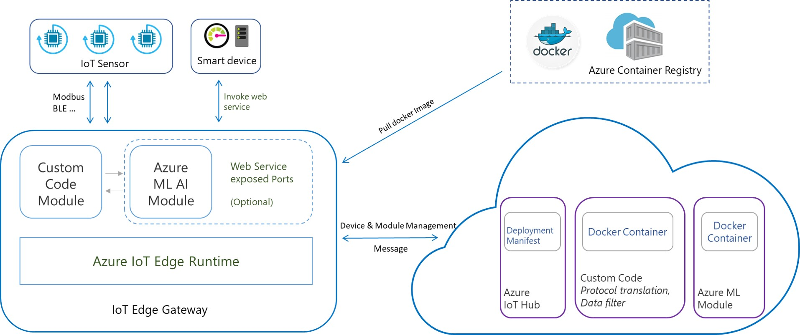
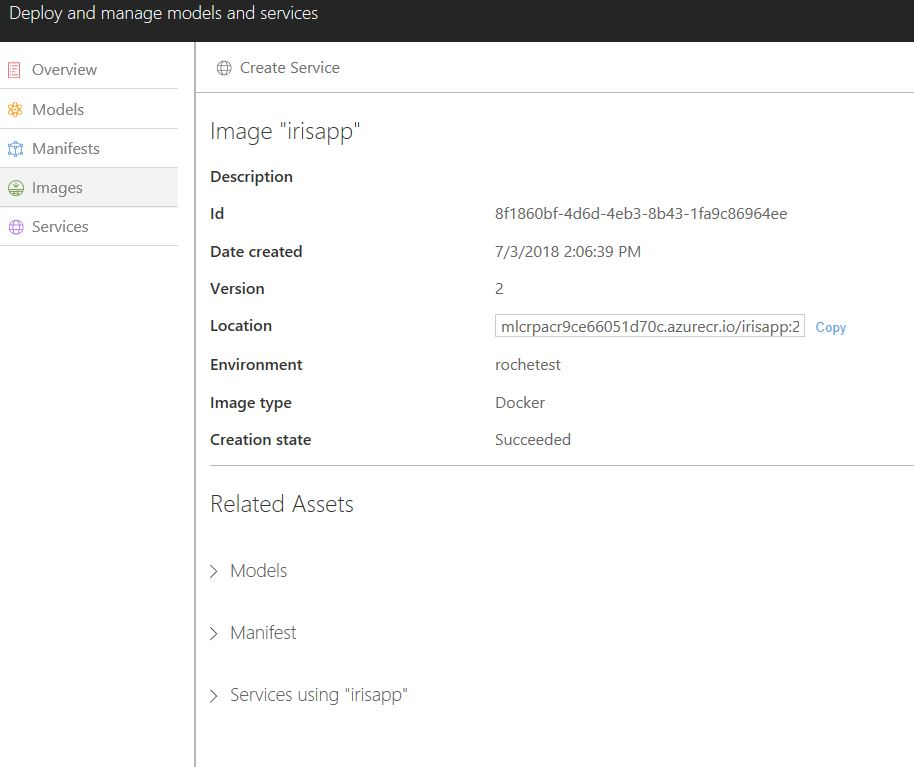

# PdM-On-Azure
This is a template for PdM on Azure

## Architecture of PdM

There are two parts for PdM scenarios: 
- ML Model Training part
- IoT Solution part

## Azure Service
* DSVM (Data Science Virtual Machine)
* HDInsight - Spark
* Azure Machine Learning Service
    * Azure Machine Learning Workbench
    * Azure Machine Learning Model Management
* IoT (Internet of Things)
    * IoT Hub
    * IoT Edge

## Prerequisites
If you don't have an Azure subscription, create a [free account](https://azure.microsoft.com/free/?WT.mc_id=A261C142F) before you begin.
To complete this tutorial, you must have:
- An Azure Machine Learning Experimentation account
- Azure Machine Learning Workbench installed
- A Docker engine installed and running locally. Docker's Community Edition is sufficient. Learn how to install Docker [here](https://docs.docker.com/engine/installation/).

## Environment Setup

#### Use Data Science Virtual Machine (RECOMMENDED)
1. Create a new DSVM windows 2016 with CPU following the [Documentation](https://docs.microsoft.com/en-us/azure/machine-learning/data-science-virtual-machine/provision-vm)
2. After creation of DSVM, use RDP to connect to the VM;
3. Install Azure Machine Learning Workbench using the `AmlWorkbenchSetup.exe` on the Desktop and it takes about 10-20 minutes to finish the installation.
4. After installation, launch AML workbench and login with azure account.
    4.1. if your account don't have an AML experimentation, you should create one first
        4.1.1. Open `Command Line Windows`;
        4.1.2. Login in using Azure CLI
            
            az login

        4.1.3. Setup Default Active Subscription in Azure account

            az account list
            
            az account set -s \<subscription id>
        
        4.1.4. Create new experimentation

            az ml account experimentation create -n \<experimenataion name> -g \<resource group name>

        4.1.5. Reload or relaunch AML workbench

#### Use Local PC
1. Install Azure Machine Learning Workbench by following the [tutorial](https://docs.microsoft.com/en-us/azure/machine-learning/service/quickstart-installation
). It takes about 20-30 minutes to finish the installation.

2. Reload or relaunch AML workbench

## Machine Learning Model Training
1. Clone the GitHub repo to your local path: 
   
        git clone https://github.com/MS-CSE-GCR/PdM-On-Azure.git
        cd PdM-On-Azure
2. In Azure Machine Learning Workbench, `+` - `Add Existing Folder as Project` -  Browse to ./example/myIris and Create the project;

3. [Data Preparation](https://docs.microsoft.com/en-us/azure/machine-learning/desktop-workbench/tutorial-classifying-iris-part-1)

4. [Model Building](https://docs.microsoft.com/en-us/azure/machine-learning/desktop-workbench/tutorial-classifying-iris-part-2)

5. [Model Deployment](https://docs.microsoft.com/en-us/azure/machine-learning/desktop-workbench/tutorial-classifying-iris-part-3)

6. After you have deployed your model to ACR with model management, you can check all your images, manifests, web services in the model management you created in [azure portal](https://portal.azure.com)

7. You can use this script to check the login info and then follow the IoT Tutorial to build the PdM service.
        
        az ml image usage -i <image ID>
        az ml env get-credentials -g <resource group name> -n <deployment account>

## Good Reference
* [How to read/write files](https://docs.microsoft.com/en-us/azure/machine-learning/desktop-workbench/how-to-read-write-files)
* [How to use MMLSpark](https://docs.microsoft.com/en-us/azure/machine-learning/desktop-workbench/how-to-use-mmlspark)
* [Create DSVM and HDI Spark Cluster](https://docs.microsoft.com/en-us/azure/machine-learning/desktop-workbench/how-to-create-dsvm-hdi#create-an-apache-spark-for-azure-hdinsight-cluster-in-azure-portal)
* [All the CLI script you would use](./AML_CLI.md)

